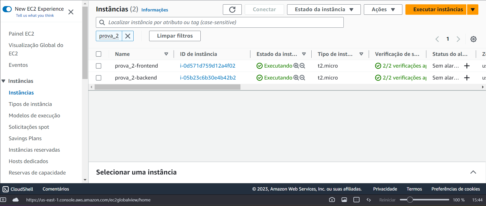
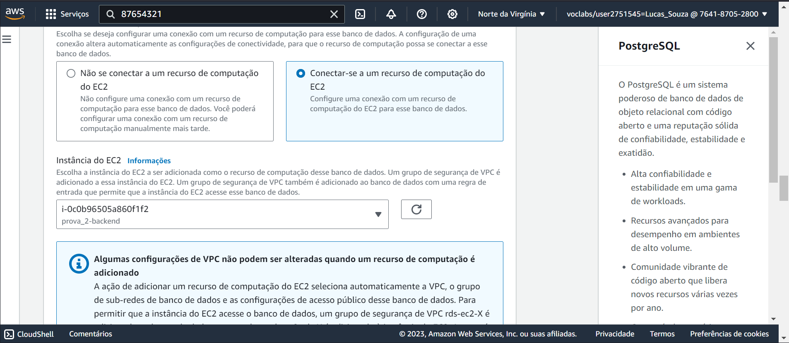
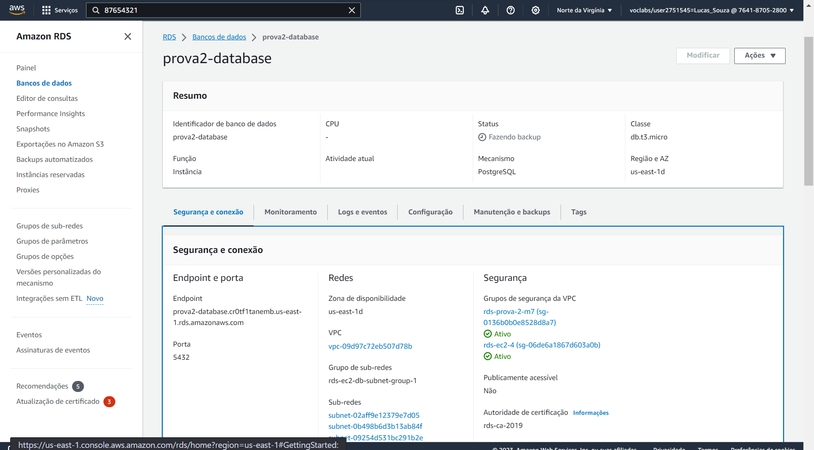
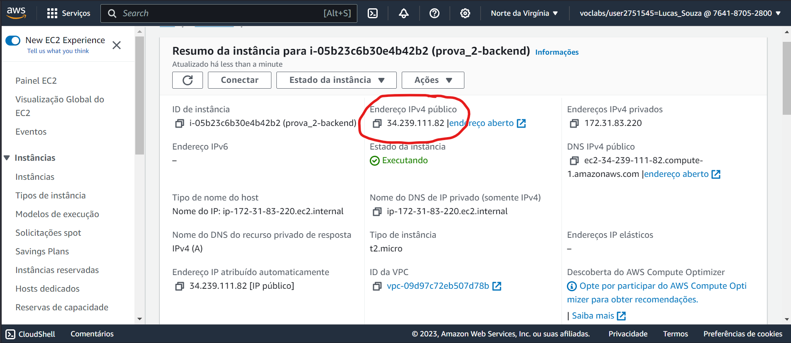
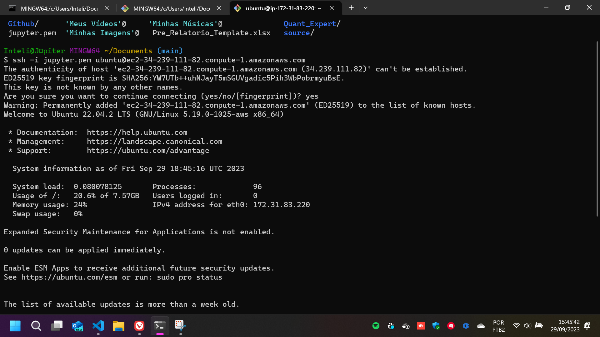
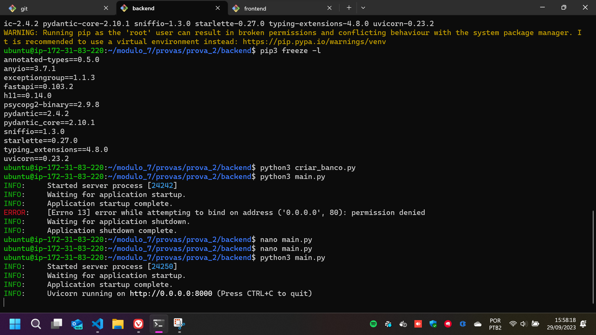
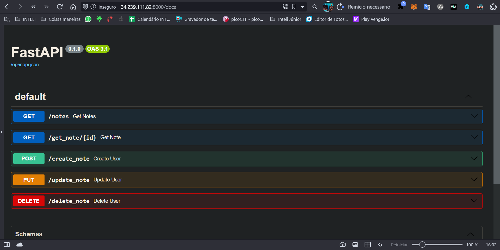
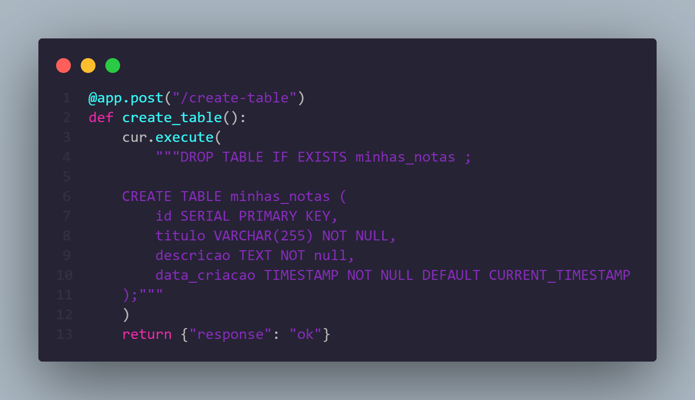
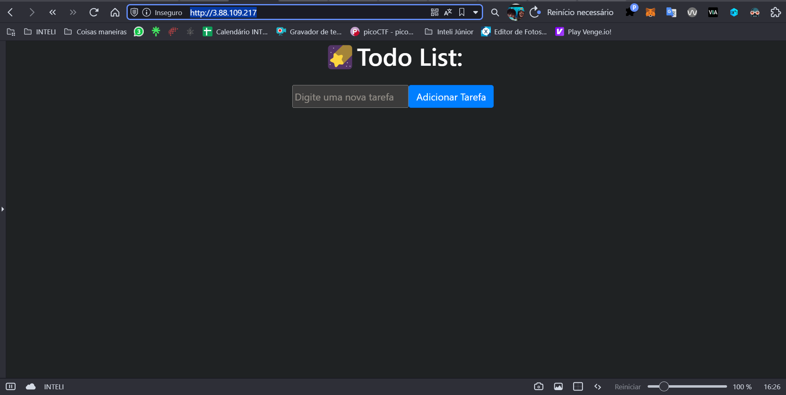

# Prova 2 - Módulo 7 - AWS

## Enunciado
O objetivo desta atividade prática é que os alunos ganhem experiência na configuração e implantação de uma aplicação web simples na Amazon Web Services (AWS). Eles serão responsáveis por criar uma infraestrutura básica na AWS que inclui um frontend, um backend e um banco de dados, além de configurar a comunicação entre esses elementos.
Cada um desses recursos deve ser criado utilizando uma instância de EC2 para sua execução. O banco de dados pode ser criado utilizando o serviço de RDS.

## EC2

### Passo a passo

#### Passos 1 e 2: Criar instâncias EC2 para frontend e backend
Criação de um EC2 para o frontend e outro para o backend. Aqui, o frontend possui permissões de entrada na porta 80 (usaremos o apache para disponibilizá-lo), já o backend, coloquei qualquer configuração e mudarei ela para colocar na porta 8000.

#### Passo 3: Criar um RDS utilizando postgres.
Criaremos um RDS utilizando postgres. Para isso, configuramos para que ele tenha conexão com o EC2 do backend:

Concomitantemente, alteramos as configurações de acesso no próprio backend. Acessaremos o banco por meio das seguintes configurações:
<pre><code>DB_USER = "jupiter"
DB_PASSWORD = "87654321"
DB_HOST = "prova-2-database.cr0tf1tanemb.us-east-1.rds.amazonaws.com"
DB_PORT = "5432"
DB_NAME = "prova2"</code></pre>

#### Passo 4: Comunicação e Implantação
Antes de entrar nos EC2's, vamos arrumar algumas questões aqui nos próprios serviços.
Primeiro, precisamos garantir que as requisições que o frontend for fazer ao backend estão corretas, por isso, colocamos, no local do host de cada requisição, a rota correta para o EC2 do backend utilizando seu IPv4 público. 

Agora sim, vamos acessar os EC2 e fazer tudo funcionar.

#### Passo 5: Colocando o backend no EC2
Vamos começar pelo backend. Para colocar nosso backend lá, vamos acessar o EC2 por meio de ssh. No meu caso, apenas preciso utilizar a chave .pem que criei quando o EC2 foi criado.
<pre><code>ssh -i jupyter.pem ubuntu@ec2-34-239-111-82.compute-1.amazonaws.com</code></pre>

Aqui, vamos primeiro instalar o python.
<pre><code>sudo apt update
sudo apt upgrade
sudo apt install python3-pip</code></pre>

Agora, clonamos este repositório para o EC2
<pre><code>git clone https://github.com/Lukovsk/modulo_7.git</code></pre>

Entrando na pasta provas/prova_2/backend, vamos primeiro criar o banco de dados lá pro RDS. Para isso, executamos o script criar_banco, depois, rodamos o backend.
Antes disso, vamos instalar as bibliotecas necessárias:
<pre><code>sudo pip3 install -r requirements.txt
python3 criar_banco.py
python3 main.py</code></pre>

Para verificar se está acessível, vamos tentar acessar pelo navegador a rota [http://34.239.111.82:8000/docs](http://34.239.111.82:8000/docs) do servidor fastapi: 

Testando as rotas, vi que o banco não estava criado, por isso, criei uma rota no backend que cria a tabela:

Assim, ligando a api e usando essa rota uma vez, o banco é criado e as outras rotas funcionam.
Boa! Agora vamos para o frontend.

#### Passo 6: Colocando o frontend no EC2
Com o backend criado, vamos colocar nosso frontend no outro ec2. Entraremos no EC2 da mesma forma:
<pre><code>ssh -i jupyter.pem ubuntu@ec2-3-88-109-217.compute-1.amazonaws.com</code></pre>
Aqui, primeiramente vamos instalar o apache2. Depois, podemos simplesmente colocar o frontend deste repositório no diretório var/www/html que já estará servindo na web!
<pre><code>sudo apt update
sudo apt upgrade
sudo apt install apache2
git clone https://github.com/Lukovsk/modulo_7.git
sudo cp -r ./modulo_7/provas/prova_2/frontend /var/www/
sudo mv /var/www/frontend /var/www/html</code></pre>

Pronto! Temos nosso frontend na web pela rota [http://3.88.109.217](http://3.88.109.217)

