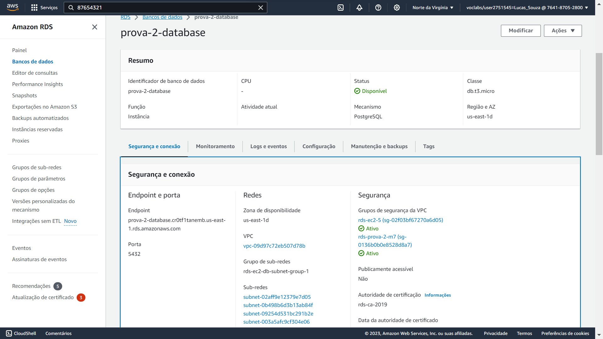

# Prova 2 - Módulo 7 - AWS

## Enunciado
O objetivo desta atividade prática é que os alunos ganhem experiência na configuração e implantação de uma aplicação web simples na Amazon Web Services (AWS). Eles serão responsáveis por criar uma infraestrutura básica na AWS que inclui um frontend, um backend e um banco de dados, além de configurar a comunicação entre esses elementos.
Cada um desses recursos deve ser criado utilizando uma instância de EC2 para sua execução. O banco de dados pode ser criado utilizando o serviço de RDS.

## EC2

### Passo a passo

#### Passos 1 e 2: Criar instâncias EC2 para frontend e backend
Criação de um EC2 para o frontend e outro para o backend. Aqui, o frontend possui permissões de entrada na porta 80 (usaremos o apache para disponibilizá-lo), já o backend, coloquei qualquer configuração e mudarei ela para colocar na porta 8000.


#### Passo 3: Criar um RDS utilizando postgres.
Criaremos um RDS utilizando postgres. Para isso, configuramos para que ele tenha conexão com o EC2 do backend:


Concomitantemente, alteramos as configurações de acesso no próprio backend. Acessaremos o banco por meio das seguintes configurações:
<pre><code>DB_USER = "jupiter"
DB_PASSWORD = "87654321"
DB_HOST = "prova-2-database.cr0tf1tanemb.us-east-1.rds.amazonaws.com"
DB_PORT = "5432"
DB_NAME = "prova2"</code></pre>

#### Passo 4: Comunicação e Implantação
Antes de entrar nos EC2's, vamos arrumar algumas questões aqui nos próprios serviços.
Primeiro, precisamos garantir que as requisições que o frontend for fazer ao backend estão corretas, por isso, colocamos, no local do host de cada requisição, a rota correta para o EC2 do backend utilizando seu IPv4 público. 


Agora sim, vamos acessar os EC2 e fazer tudo funcionar.

#### Passo 5: Colocando o backend no EC2
Vamos começar pelo backend. Para colocar nosso backend lá, vamos acessar o EC2 por meio de ssh. No meu caso, apenas preciso utilizar a chave .pem que criei quando o EC2 foi criado.
```ssh -i jupyter.pem ubuntu@ec2-34-239-111-82.compute-1.amazonaws.com```


Aqui, vamos primeiro instalar o python.
```sudo apt update```
```sudo apt ugrade```
```sudo apt-get install python3```


#### Passo 6: Colocando o frontend no EC2
Com o backend criado, vamos colocar nosso frontend no outro ec2. Entraremos no EC2 da mesma forma:
```ssh -i jupyter.pem ubuntu@ec2-3-88-109-217.compute-1.amazonaws.com```
